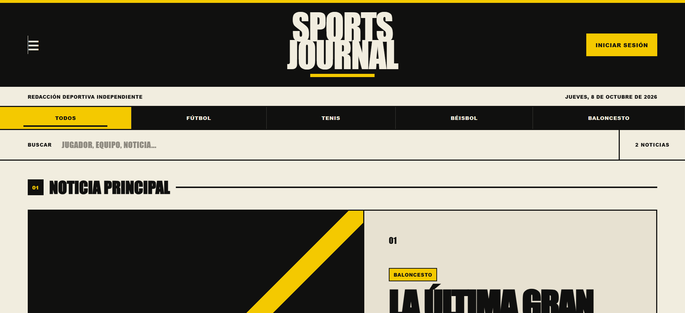
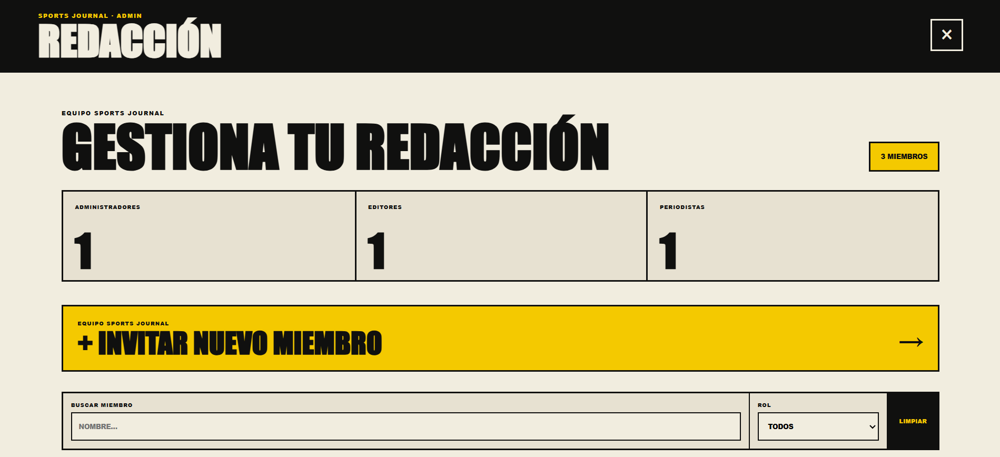
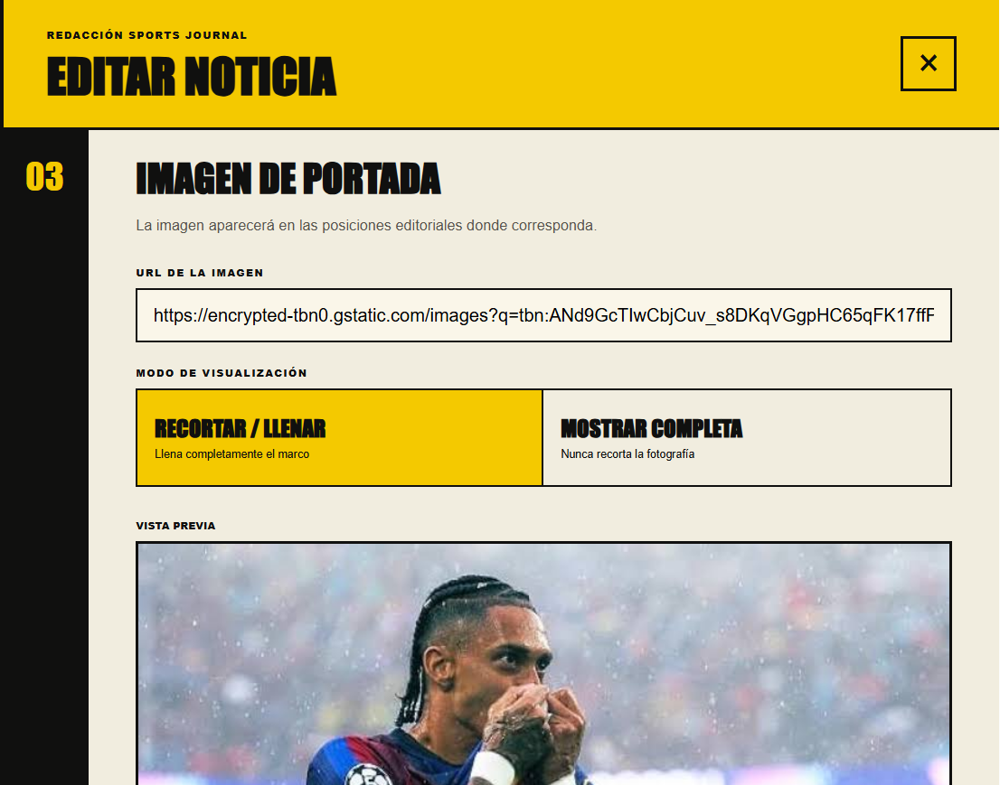
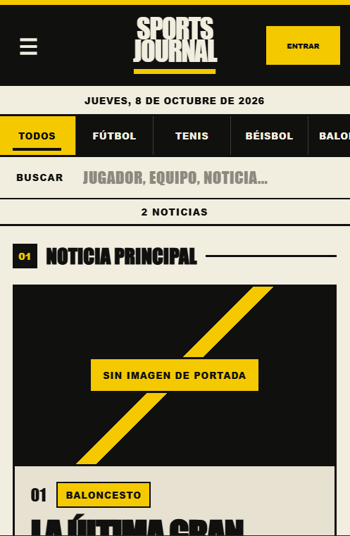

# SPORTS JOURNAL — V1 Case Study

A multi-user sports publishing platform built with vanilla JavaScript and Supabase.

## 1. Project Overview

SPORTS JOURNAL is a sports publication covering Football, Tennis, Baseball and Basketball. Its Spanish-language public experience connects an editorial homepage, article reader and author profiles with a private newsroom for creating, reviewing and publishing stories.

V1 combines a static frontend with cloud data and authenticated editorial operations. The interesting engineering work sits at that boundary: a reader should experience a publication, while newsroom members need ownership, permissions and predictable behavior as data and sessions change.

**Live demo:** [SPORTS JOURNAL](https://jatoteran.github.io/sports-journal/)

## 2. The Initial Goal

The project began as a browser-based sports publication. Local article management and browser storage provided a foundation for the reading experience and editing tools. The repository still contains those mechanisms alongside the later cloud integration, and its history records the introduction of Supabase authentication, article migration and cloud workflows.

The implementation reflects four priorities: develop the frontend without a framework, establish a recognizable editorial identity, move persistence beyond one browser, and support multiple contributors with different responsibilities. Each expansion introduced constraints that the earlier interface did not have to handle.

Moving to a newsroom meant that an article was no longer just an object rendered on a page. It had an author, a lifecycle and an audience determined by its publication state. Preserving the existing product while introducing those relationships became a central design problem.

## 3. Product Experience

The public interface uses large headlines, numbered stories, a paper-colored background and strong black-and-yellow contrasts. Sport navigation and search sit near the top of the homepage. The visual hierarchy emphasizes coverage and reading rather than administrative controls.

Readers can browse by sport, search stories and follow topic/tag navigation. The article reader connects a headline and summary with article content, attribution and sharing. Previous/next navigation and related stories provide continuation after the current article.

Permanent story URLs make articles accessible outside the homepage. Public author profiles connect attribution to published work; About explains the publication, while Contact provides email and copy-email actions. These surfaces give the site context beyond an article feed without requiring reader authentication.



*Public homepage: editorial identity, sport navigation and search.*

## 4. Architecture

```text
Browser: HTML / CSS / vanilla JavaScript
  -> GitHub Pages static frontend
  -> Supabase JavaScript client
       -> Supabase Auth
       -> PostgreSQL tables / backend authorization
       -> Invitation Edge Function
```

The application behaves like a SPA within a single HTML document. JavaScript renders articles, opens modal views and synchronizes public navigation with query parameters and browser history. The Supabase client is loaded from a CDN and initialized by a separate configuration file. There is no frontend framework, npm manifest or build system in this checkout.

This architecture keeps deployment straightforward for the project's scope, but it places responsibility for state coordination in application code. Routing, focus, metadata and asynchronous work require explicit handling. Static hosting also limits what article-specific content a crawler can receive before JavaScript runs.

The client accesses `articles` and `profiles`, uses Supabase Auth, and invokes `invite-newsroom-member` for invitations. Backend authorization must be enforced through the deployed policies, including RLS. SQL definitions and the Edge Function source are absent from this checkout; the repository demonstrates their client integration, not a reproducible backend deployment or a formal policy audit.

## 5. Moving From Local State to Cloud Data

The original data model supported local article collections, automatic snapshots and JSON backups. Cloud persistence introduced database rows, authenticated authors and editorial statuses while the existing rendering and editing experience still expected its familiar article shape.

The current code bridges those representations. It maps database fields into frontend article objects and converts backup articles into cloud rows. Compatibility includes author attribution, image settings, timestamps and workflow state. The distinction matters because display state and database status are not always represented identically: review and archive handling must remain consistent across both layers.

Legacy import uses `legacy_local_id` as a conflict key, while cloud records use their database identity. The import code separates these groups and avoids sending a potentially stale cloud identifier when matching a legacy article. That is concrete compatibility work, rather than evidence of a complete database migration system.

Successful cloud writes reload the canonical dataset. Browser snapshots remain recovery tools, with fallback data restricted by user and role context. They do not turn V1 into an offline publishing system. The broader lesson was that changing the source of truth required revisiting identity, failure handling and recovery, not just replacing local writes with network requests.

## 6. Building a Multi-User Newsroom

Three roles organize editorial responsibility. ADMIN combines editorial access with member-role management, invitations and backup tools. EDITOR handles broader article operations, including review, publication and archiving. JOURNALIST works through a personal dashboard and creates, edits or deletes their own drafts and review submissions.

Ownership is part of that distinction. A journalist's editable work is tied to the authenticated member, and publishing controls become submission controls for that role. Published and archived articles can appear in their dashboard without becoming personally editable through the same workflow.

Permissions affect both actions and navigation. Private openers are hidden when access is unavailable, and already-open panels are closed when their session or role context becomes invalid. Frontend guards prevent confusing interactions; backend authorization must independently reject unauthorized operations. The available source supports the former and relies on the deployed Supabase configuration for the latter.



*Newsroom management: member roles, invitations and filtering.*

## 7. Editorial Workflow

```text
Draft -> Review -> Published -> Archived
```

Journalists save drafts and submit stories for review. Editors and administrators can publish submissions or return them to draft, and can publish drafts directly. Publication makes a story eligible for the public experience; archiving removes it from that experience while retaining it for editorial management.

The lifecycle allows revisions. Editors and administrators can republish an archived article or move it back to draft. These transitions require consistent status and timestamp handling, plus refreshed collections so the reader, management views and counts reflect the current dataset.

The editor also preserves image presentation choices: cover-image position, zoom and crop/fit mode are saved with the article. Those controls connect the editing experience to the publication's layout instead of treating an image URL as the entire editorial decision.



*Article editor: cover-image presentation controls and preview.*

## 8. Public Routing Without a Framework

| Query parameter | Public view |
| --- | --- |
| `?story=<slug>` | Article reader |
| `?author=<id>` | Author profile |
| `?page=about` | About |
| `?page=contact` | Contact |

Direct navigation and reload require coordinating the URL with data availability. A story may not be in memory when the document first loads, so route synchronization also occurs after articles are fetched. A missing or unavailable story must not leave an unrelated reader open.

Back/Forward navigation adds another constraint: restoring a view should not create another history entry. The implementation uses push/replace operations and `popstate` handling to distinguish navigation from restoration. Public route handlers also remove conflicting parameters and close competing views.

This is more than showing and hiding DOM elements. The active view owns a URL, metadata, focus and scroll behavior. Closing it or navigating elsewhere must update that connected state. Author loading adds its own sequence guard so a delayed response cannot repaint a profile that has already been closed or replaced.

## 9. Responsive Editorial UX

Responsive work preserves the publication's hierarchy while changing how it fits. The mobile header is more compact, sport navigation accommodates limited width, and story layouts reduce the density of the desktop presentation. The reader adjusts headline sizing, metadata spacing and continuation navigation for narrower screens.

Private editing introduces different constraints: a form must remain usable while users enter text, adjust images and reach save actions. Mobile editor and management styles reorganize controls, wrap long content and provide room for actions. Confirmation dialogs also have short-viewport adjustments so essential controls remain reachable when vertical space is limited.

The code and commit history show focused iterations on the homepage, reader, editor and editorial panel density. They do not establish a recorded test matrix at specific device widths. The included mobile capture illustrates the resulting layout, while exact viewport coverage remains undocumented.



*Mobile layout: compact header, sport navigation and stacked lead-story content.*

## 10. The Hardest Engineering Problems

### Async Authentication Context

An operation can begin for user A, pause during a network request and resume after logout or a new login as user B. Reading the current session only at the beginning is insufficient: the response belongs to an earlier context even if it arrives successfully.

The application uses initiating user identity and a session version to establish ownership. After relevant awaits, it checks that the identity, session and loaded profile still agree. Session versions also distinguish an earlier session from a later session for the same account. This prevents old work from acting on a newly valid interface merely because an account identifier matches again.

### Stale Article Saves

The final release hardening included a specific failure sequence:

```text
User A starts a save
  -> logout
  -> user B opens another editor
  -> the earlier save response returns
```

An old completion could otherwise close or clear the new editor. The fix captures the initiating user, session version, article context, editor version and save sequence. It also compares the current editor state with the submitted state, protecting edits made while the request is pending.

The context is revalidated after the database response and after the canonical dataset reload. If ownership has changed, completion handling returns without applying its UI effects. The database write may already have succeeded; ignoring a stale completion protects the active interface and does not claim to cancel or roll back that write.

### Public/Private UI Isolation

Authentication changes should invalidate private panels without indiscriminately closing public content. The application separately synchronizes editorial access and cloud article context. It hides invalid controls before restoring focus and closes private surfaces whose permissions no longer apply.

A currently open published story can be retained during a context reload, but the reader closes when its article is no longer available. Author, About and Contact views are public surfaces with separate navigation handling. This distinction keeps session transitions from either preserving private access or unnecessarily disrupting public reading.

### History and Metadata State

The reader, author profile and informational pages update document state as well as visible content. Base metadata is captured for restoration, while active public views set their own title and canonical information.

Without coordinated cleanup, navigation could leave a previous article's metadata attached to another view. Route synchronization and metadata restoration therefore form part of view lifecycle handling, alongside closing dialogs and restoring focus.

## 11. SEO and Sharing Trade-offs

The static document includes canonical, Open Graph and Twitter metadata, plus `WebSite` structured data. Article navigation updates metadata in the browser and inserts `NewsArticle` structured data. Share URLs identify the published story through its slug.

Native Web Share is used when supported. Alternatives include WhatsApp, Facebook and X links, with clipboard and manual-copy fallbacks. These are sharing mechanisms, not connected publication social accounts.

The hosting trade-off is explicit: GitHub Pages returns static HTML, and story-specific metadata is applied client-side. Crawlers that do not execute JavaScript may receive generic previews. Prerendering or server rendering would be a possible next step for richer previews, but V1 does not implement either.

## 12. Testing and Release Hardening

Repository history records focused fixes for snapshot isolation, password-setup context, private UI access, unavailable reader articles, mobile layouts, focus handling and stale saves. A final QA merge places the save-context fix within the release sequence. These changes show targeted hardening rather than evidence of a comprehensive automated test suite.

The important regression scenarios follow directly from those fixes:

- Role and ownership checks across drafts, review, publication and archive actions.
- Direct links, reload and Back/Forward navigation between public views.
- Responsive reading, editing and confirmations on narrow or short viewports.
- Delayed saves and profile responses across logout, login or view changes.
- Loss of access while private panels or a reader are already open.

Those scenarios explain what release validation must protect. This checkout contains no test framework, CI configuration, execution reports or production/mobile smoke-test records. It therefore does not substantiate pass counts, exact tested viewport sizes or coverage percentages. The screenshots document visible states, not comprehensive behavioral test results.

## 13. Performance and Accessibility

Static deployment and the absence of a framework runtime keep the initial application structure straightforward. That does not establish a measured performance result: the repository contains no compressed-payload audit, timing report or benchmark. Network access to the CDN, Supabase and article images remains part of the experience.

Accessibility work includes keyboard interactions, modal focus handling and restoration, ARIA attributes, touch-sized controls and responsive wrapping. Short-screen confirmation adjustments also help keep actions reachable. Focus restoration must account for controls that become hidden after a permission change.

These are specific improvements visible in the implementation. They do not imply WCAG certification or complete assistive-technology coverage. Further accessibility and image-performance work remain reasonable extensions of V1.

## 14. What I Learned

The most useful lesson was to treat asynchronous work as owned by a context. Awaiting a request only orders code; it does not guarantee that the original user, article or editor still exists when execution resumes. Capturing ownership and revalidating it makes that assumption explicit.

I also learned to separate interface permissions from authorization. A role-aware UI communicates what a member can do, while the backend must enforce the boundary independently. Session transitions expose why both layers matter, especially when private panels are already open.

Browser history became application state rather than a navigation accessory. URLs, visible views and metadata need to agree through direct entry, reload and Back/Forward actions. Responsive work similarly requires attention to whole tasks, including reading continuation and reaching editor actions, rather than only shrinking individual elements.

Finally, preserving compatibility was more demanding than adding a new cloud API call. Existing article shapes, backups and editorial behavior all carried assumptions. Keeping V1's scope bounded made it possible to address those interactions before expanding into additional publication services.

## 15. What I Would Build Next

My first priorities would be richer social previews through prerendering or server rendering, image optimization, and further accessibility validation. Newsletter, analytics, social channels and community features such as comments are possible product extensions, subject to editorial needs. None is presented as part of V1 or tied to a delivery date.

## 16. Final Result

SPORTS JOURNAL V1 developed from a frontend publication into a cloud-backed editorial system. Its public reading experience now connects with a multi-user newsroom, role-aware workflows, responsive layouts, permanent routes and sharing metadata. Release hardening addresses the less visible interactions between sessions, asynchronous responses and active views.

The resulting project demonstrates product and engineering decisions within a deliberately limited architecture, with its static metadata and backend reproducibility limits documented. V1's feature set is complete and in code freeze; documentation presents both the implemented behavior and the boundaries of the available evidence.

**Live demo:** [SPORTS JOURNAL](https://jatoteran.github.io/sports-journal/)

For setup instructions and the feature reference, see the [project README](../README.md).
